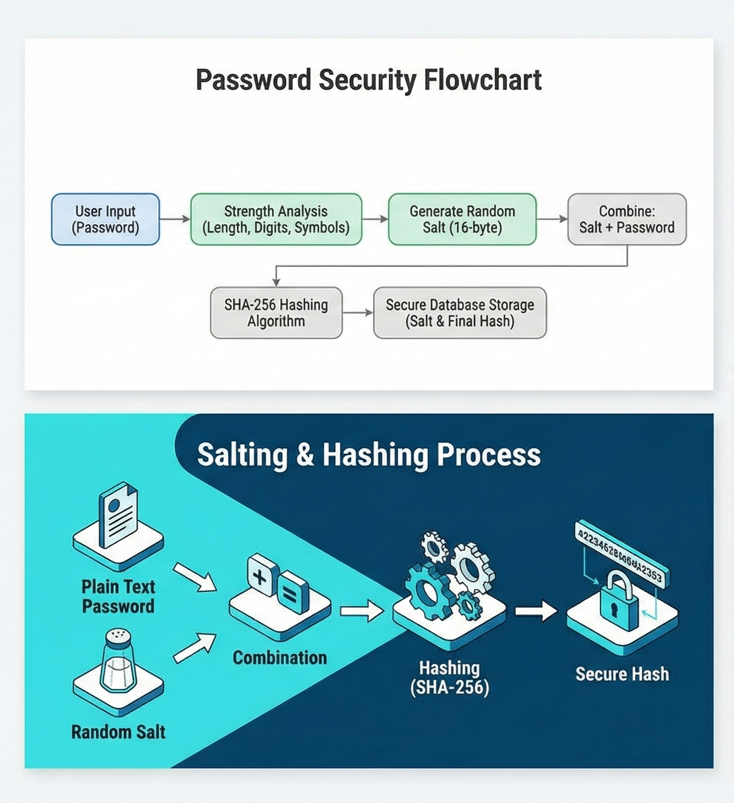

# 🔐 Password Analyser & Cracking Tool


> **University Project** | Department of Information Technology  
> **Team:** Ships Group  
> **Leader:** Ahmed Mohammed Saad El-Raggal (ID: 2221300)

## 📖 Overview
[cite_start]This project is an educational cybersecurity tool designed to demonstrate the difference between weak and secure authentication mechanisms[cite: 25, 111]. It serves two main purposes:
1.  [cite_start]**Defensive Analysis:** Real-time evaluation of password strength (Brute-force resistance)[cite: 19, 105].
2.  [cite_start]**Secure Storage Simulation:** Demonstrating how modern databases store passwords using **Salting** and **SHA-256 Hashing**[cite: 20, 106].

## 🚀 Key Features
* [cite_start]**Strength Checker:** Evaluates passwords based on length, numbers, uppercase letters, and symbols[cite: 45, 131].
* [cite_start]**Salting Implementation:** Generates a unique 16-byte random salt for every input to prevent Rainbow Table attacks[cite: 38, 124].
* [cite_start]**SHA-256 Hashing:** Converts the salted password into a secure fixed-size 256-bit string[cite: 36, 122].
* [cite_start]**Dual Interface:** Includes both a Command Line Interface (CLI) and a Web Interface (Flask)[cite: 31, 117].

## 🛠️ Project Architecture


*Figure 1: The logic flow from user input to secure storage.*

### The Security Formula Used:
$$FinalHash = SHA256(RandomSalt + UserPassword)$$
[cite_start][cite: 41, 127]

## 📂 Repository Structure
```text
├── src/
│   ├── 1_cli_tool.py       # Simple Command Line Tool
│   ├── 2_local_server.py   # Standalone Local Server (No Flask required)
│   └── 3_flask_web_app.py  # Full Web Application (Requires Flask)
├── assets/                 # Project Diagrams & Screenshots
└── README.md               # Documentation
